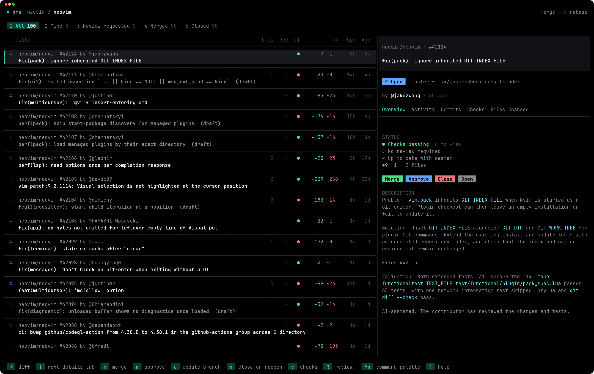

<div align="center">

# prs

**Review and merge pull requests from your terminal.**

[](https://github.com/nandatheguntupalli/prs/actions/workflows/ci.yml) [](https://github.com/nandatheguntupalli/prs/releases/latest) [](https://github.com/nandatheguntupalli/homebrew-tap) [](LICENSE) [](https://bun.sh)

[Install](#install) · [Usage](#usage) · [Keys](#keys) · [Stacked PRs](#stacked-prs) · [Settings](#settings) · [Contributing](#contributing)

</div>



---

## What it does

prs lists the open pull requests in a repo, or every PR you're involved in across GitHub, and lets you work through them from the keyboard.

- Merge, close, approve or update a branch with a single key. Merges wait a few seconds first, so there's time to undo.
- Read the diff with review comments inline, and leave comments on a line or a range of lines. Test files are hidden until you press `T`, so you see the code first.
- Expand any file in the Files Changed tab to see its changes without leaving the list.
- Check CI without opening a browser. You can open an Actions job and jump straight to the lines that errored.
- Stacked PRs show up together, and merging one merges everything under it. GitHub's native stacks work too.
- Add your own tabs from any GitHub search, pick a theme (or let it follow your terminal's light and dark mode), and open a PR's clone in your editor.

## Install

```sh
brew install nandatheguntupalli/tap/prs
```

There are also macOS and Linux binaries on the [releases page](https://github.com/nandatheguntupalli/prs/releases/latest).

prs uses your [`gh`](https://cli.github.com) login, so run `gh auth login` first if you haven't. It'll use `GITHUB_TOKEN` instead if that's set.

## Usage

```sh
prs                   # the repo you're in
prs owner/repo        # some other repo
prs --all             # your PRs across GitHub
prs --method squash   # merge (default), squash or rebase
prs --update merge    # how `u` updates a branch: rebase (default) or merge
prs --delay 2         # seconds before a merge or close goes through (default 4)
prs --dry-run         # try it out without changing anything on GitHub
```

`?` shows every key and `ctrl+p` opens the command palette.

In a repo, the tabs are All, Mine, Review requested, Merged and Closed. With `--all` they're Mine, Review requested, Involved, Merged and Closed, across every repo you have access to.

Merges and closes wait a few seconds before they go through, and `z` cancels them in that window. Once a PR is merged or closed it stays in the list with a Merged or Closed badge until you refresh with `r`, the same way GitHub leaves it on the page.

## Keys

<table>
<tr><th>Pull requests</th><th>Moving around</th><th>Diffs</th></tr>
<tr valign="top"><td>

| key |                  |
| --- | ---------------- |
| `m` | merge            |
| `x` | close / reopen   |
| `z` | undo             |
| `a` | approve          |
| `R` | review           |
| `u` | update branch    |
| `s` | toggle draft     |
| `L` | labels           |
| `c` | checks and logs  |
| `y` | copy             |
| `e` | open in editor   |
| `B` | check out branch |
| `o` | open in browser  |

</td><td>

| key               |                |
| ----------------- | -------------- |
| `j` `k`           | move           |
| `gg` `G`          | top, bottom    |
| `ctrl+d` `ctrl+u` | page           |
| `tab` `1`-`9`     | switch tabs    |
| `/`               | filter         |
| `⏎` `d`           | open diff      |
| `[` `]`           | details tabs   |
| `E`               | expand files   |
| `p`               | toggle details |
| `{` `}` `=`       | resize details |
| `t`               | theme          |
| `r`               | refresh        |

</td><td>

| key     |                     |
| ------- | ------------------- |
| `]` `[` | next / prev file    |
| `f`     | jump to file        |
| `T`     | show / hide tests   |
| `n` `p` | next / prev comment |
| `⏎`     | comment or reply    |
| `v`     | select lines        |
| `J` `K` | next / prev PR      |

</td></tr>
</table>

## Stacked PRs

If one PR's base branch is another PR's branch, prs groups them as a stack. Merging a PR in a stack also merges everything below it, and the Merge button shows how many PRs that is.

Native GitHub stacks go through `gh stack merge`, which needs the [gh-stack](https://github.com/github/gh-stack) extension. Other stacks are merged from the top down, each PR into its parent's branch. Any PRs above get pointed at the new base before a branch is deleted, so GitHub doesn't close them.

One catch with squash merges: the PRs above still have the original commits, so they'll need a restack (`gh stack sync` or `git rebase --onto`). prs leaves that to you because it means force-pushing someone else's branch.

## Settings

Settings go in `~/.config/prs/config.json`. Everything is optional:

```jsonc
{
  // "system", "midnight", "graphite", "nord", "tokyo" or "paper"
  "theme": "system",

  // "plain" if your font doesn't have Nerd Font icons
  "icons": "nerd",

  // what `e` runs. Available: {{repo}} {{owner}} {{name}} {{number}}
  // {{headRef}} {{baseRef}} {{author}} {{url}} {{repoPath}}
  "editorCommand": "code {{repoPath}}",

  // extra tabs, as GitHub searches
  "sections": [
    { "title": "Bugs", "filter": "is:open label:bug" },
    { "title": "Dependabot", "filter": "is:open author:app/dependabot" },
  ],

  // where your clones live, for `e` and `B`
  "repoPaths": {
    "me/dotfiles": "~/dotfiles",
    "my-org/*": "~/work/*",
    ":owner/:repo": "~/src/:owner/:repo",
  },
}
```

If you don't set `editorCommand`, `e` opens the clone in `$VISUAL` or `$EDITOR`.

## Contributing

Issues and PRs are welcome. [CONTRIBUTING.md](CONTRIBUTING.md) covers setup, but the short version is:

```sh
bun install
bun start owner/repo --dry-run
```

## License

[MIT](LICENSE) © Nanda Guntupalli
